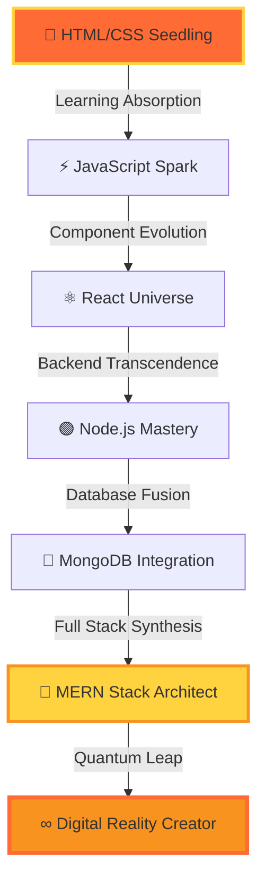

<div align="center">

# ⚡ QUANTUM DEVELOPER INTERFACE ACTIVATED ⚡


<details>
<summary>🌟 CLICK TO ENTER THE QUANTUM REALM 🌟</summary>

```
╔═══════════════════════════════════════════════════════════════════════════════════╗
║  🌌 WELCOME TO THE MULTIVERSE OF CODE 🌌                                          ║
║                                                                                   ║
║  You have entered the quantum dimension where code transcends reality            ║
║  Every commit ripples through the fabric of digital space-time                   ║
║                                                                                   ║
╚═══════════════════════════════════════════════════════════════════════════════════╝
```

</details>


</div>

---

## 🧬 QUANTUM DEVELOPER DNA

<table width="100%">
<tr>
<td width="50%">

```typescript
class QuantumDeveloper implements Reality {
  readonly name: string = "Shaik Mohammed Zaheer";
  readonly dimension: string = "Full Stack Universe";
  readonly quantumState: string = "Superposition";
  private consciousness: Map<string, any>;
  
  constructor() {
    this.consciousness = new Map([
      ['frontend', ['React', 'JavaScript', 'CSS3', 'HTML5']],
      ['backend', ['Node.js', 'Express', 'MongoDB']],
      ['quantum_abilities', ['Problem Solving', 'Creativity']],
      ['current_mission', 'Mastering MERN Multiverse'],
      ['power_level', '∞']
    ]);
  }
  
  async evolve(): Promise<Developer> {
    while(this.isLearning) {
      await this.absorb(new Knowledge());
      this.level++;
    }
    return this.transcend();
  }
  
  deploy(): string {
    return "🚀 Reality.push() successful!";
  }
}

const developer = new QuantumDeveloper();
console.log(developer.deploy());
```

</td>
<td width="50%">


### 🌟 QUANTUM PROPERTIES
```
⚡ Energy Level: MAXIMUM
🧠 Neural Networks: ACTIVE  
🌌 Dimensions: MULTI-STACK
🔮 Probability: SUCCESS = 100%
⭐ Quantum Entanglement: ENABLED
```

</td>
</tr>
</table>

---

## 🌐 HOLOGRAPHIC TECH STACK

<div align="center">


### ⚡ FRONTEND DIMENSION ⚡


### 🔥 BACKEND UNIVERSE 🔥


### 🛠️ QUANTUM TOOLS 🛠️


</div>

---

## 📊 QUANTUM METRICS DASHBOARD

<div align="center">


### 🌟 MULTIDIMENSIONAL ANALYTICS 🌟


<table>
<tr>
<td>

</td>
<td>

</td>
</tr>
</table>

### 🎯 LANGUAGE PROBABILITY MATRIX


### 🏆 ACHIEVEMENT CONSTELLATION


### ⚡ NEURAL ACTIVITY SPECTRUM


### 🌟 CONTRIBUTION HEATMAP VISUALIZATION


</div>

---

## 🚀 QUANTUM EVOLUTION PATH

<div align="center">




### 🎮 CURRENT LEVEL PROGRESSION

<div align="center">

| Skill Domain | Level | XP Progress | Next Unlock |
|:---:|:---:|:---:|:---:|
| 🔥 React Mastery | 75 | ████████▓▓ | Advanced Patterns |
| ⚡ Node.js Power | 70 | ███████▓▓▓ | Microservices |
| 🍃 MongoDB Fusion | 65 | ██████▓▓▓▓ | Aggregation Pro |
| 💻 C++ Logic | 60 | █████▓▓▓▓▓ | DSA Master |
| 🚀 Full Stack | 80 | ████████▓▓ | DevOps Integration |

</div>

</div>

---

## 🎯 2025 QUANTUM OBJECTIVES

<div align="center">


<details>
<summary>🎮 CLICK TO REVEAL MISSION BRIEFING 🎮</summary>

```
╔═══════════════════════════════════════════════════════════════════════════════════╗
║                            🌟 QUANTUM MISSION LOG 🌟                              ║
╠═══════════════════════════════════════════════════════════════════════════════════╣
║                                                                                   ║
║  🎯 PRIORITY ALPHA MISSIONS:                                                      ║
║  ────────────────────────────                                                    ║
║  ⚡ Master TypeScript & Next.js Reality Framework        [████████▓▓] 80%        ║
║  🚀 Deploy 8+ Production MERN Universes                 [█████▓▓▓▓▓] 50%        ║
║  🌟 Contribute to 5+ Open Source Dimensions             [███▓▓▓▓▓▓▓] 30%        ║
║  💼 Secure Quantum Developer Position                   [██▓▓▓▓▓▓▓▓] 20%        ║
║  🧠 Complete Advanced DSA Challenges                    [██████▓▓▓▓] 60%        ║
║  🔮 Build Revolutionary Portfolio                       [███████▓▓▓] 70%        ║
║                                                                                   ║
║  🎲 BONUS OBJECTIVES:                                                             ║
║  ──────────────────                                                              ║
║  🌐 Learn GraphQL & Apollo                                                       ║
║  ⚙️ Master Docker & Kubernetes                                                   ║
║  🎨 Create Mind-Blowing UI/UX                                                    ║
║  📱 Develop Mobile Apps with React Native                                        ║
║                                                                                   ║
╚═══════════════════════════════════════════════════════════════════════════════════╝
```

</details>

</div>

---

## 🌐 QUANTUM COMMUNICATION ARRAY

<div align="center">


### 📡 ESTABLISH QUANTUM LINK 📡

<table align="center">
<tr>
<td align="center">
<br>
<b>EMAIL PORTAL</b><br>
<a href="mailto:smohammedzaheershaik0323@gmail.com">

</a>
</td>
<td align="center">
<br>
<b>LINKEDIN NEXUS</b><br>
<a href="https://linkedin.com/in/iamzaheershaik">

</a>
</td>
<td align="center">
<br>
<b>GITHUB MATRIX</b><br>
<a href="https://github.com/iamzaheershaik">

</a>
</td>
</tr>
</table>

</div>

---

<div align="center">


### 🌟 QUANTUM ENTANGLEMENT ESTABLISHED 🌟


```
╔═══════════════════════════════════════════════════════════════════════════════════╗
║                        💫 REALITY SYNCHRONIZATION COMPLETE 💫                     ║
║                                                                                   ║
║  Thank you for entering my quantum dimension of code!                            ║
║  Your presence has been recorded in the multiverse logs                          ║
║                                                                                   ║
║  🌟 Don't forget to star my repositories for quantum luck! 🌟                    ║
║                                                                                   ║
╚═══════════════════════════════════════════════════════════════════════════════════╝
```


### *"In the quantum realm of code, every bug is just a feature in another dimension"* ⚡


</div>
