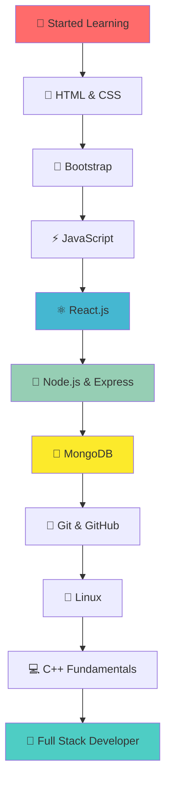

<div align="center">

# 🚀 Welcome to Zaheer's Digital Universe! 🌟


</div>

---

## 🎯 About Me


```javascript
const zaheer = {
    name: "Shaik Mohammed Zaheer",
    role: "Full Stack Developer",
    status: "Learning & Growing",
    techStack: ["MERN", "C++", "Linux"],
    motto: "Code, Learn, Repeat 🔄",
    currentFocus: "Building Amazing Web Apps",
    futureDreams: "Contributing to Open Source",
    funFact: "I debug with console.log() 😄"
};

console.log("Welcome to my GitHub! 👋");
```

<br clear="right"/>

---

## 💻 Tech Arsenal 

<div align="center">

### Frontend Wizardry ✨


### Backend Mastery ⚡


### Development Tools 🛠️


</div>

---

## 🌟 Learning Journey

<div align="center">



</div>

---

## 🔥 Current Mission

<div align="center">


### 🎯 **Mastering the MERN Stack**
### 💡 **Building Real-World Projects**  
### 🚀 **Exploring Advanced React Patterns**
### 🧠 **Strengthening Problem-Solving with C++**


</div>

---

## 📊 GitHub Analytics

<div align="center">


</div>

<div align="center">


</div>

---

## 🏆 GitHub Achievements

<div align="center">


</div>

---

## 🎨 Contribution Graph

<div align="center">


</div>

---

## 🌐 Connect With Me

<div align="center">


### Let's Build Something Amazing Together! 🚀

[](mailto:smohammedzaheershaik0323@gmail.com)
[](https://github.com/iamzaheershaik)
[](https://linkedin.com/in/iamzaheershaik)

</div>

---

## 💭 Philosophy

<div align="center">


### *"Every expert was once a beginner. Every pro was once an amateur."*


</div>

---

## 🎯 2025 Goals

<div align="center">

```diff
+ Master Advanced React Patterns & Hooks
+ Build 10+ Full Stack MERN Projects
+ Contribute to Open Source Projects
+ Learn TypeScript & Next.js
+ Master Data Structures & Algorithms with C++
+ Land My First Full Stack Developer Role
+ Build a Strong Professional Network
+ Create Projects that Solve Real-World Problems
```

</div>

---

<div align="center">

### 🌟 Thanks for Visiting! 🌟


### *Drop a ⭐ if you found my profile interesting!*


---

**Made with ❤️ by [Shaik Mohammed Zaheer](https://github.com/iamzaheershaik)**


</div>


